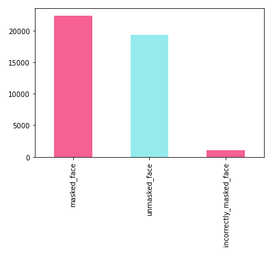

# Muzzle detector

---

## Intro

Computer Vision (CV) is an inalienable field of AI. It is applied to various real-world problems, from security to art to anything. Especially now, in the time of COVID, CV can help us to prevent a possible disaster (a massive spike of disease) by providing means of regulating face masks/covers. The primary goal of this project is to recognize not only people without a mask but those who wear masks incorrectly.


---

### **Review of the project idea**

In the last project update, we decided that we would try to implement/train both face detector and classifier by our-self. However, it turned out to be more complicated and time-consuming than we initially had expected. Actually, face detection is not a central problem of our interest; it is just a  pre-processing stage that should be done to obtain data for (in)correctly-worn-face-mask-detector. Thus, the main goal of our project will be to detect incorrectly worn masks.

---

### **Review of related materials**

We discover new data-set FMLD[1] with detected and labeled faces and some interesting annotations.  

FMLD is compiled of 2 data-sets:

1. MAFA[2]
2. WIDER FACE[3]

For both testing and training data-sets we take images of size not less than $50 \times 50$ pixels.

```json
{
	"name": "invalid_face"|"unmasked_face"|"masked_face"|"incorrectly_masked_face",
  "gender": "unspecified"|"male"|"female",
  "ethnisity": "asian"|"white"|"black"|"unspecified",
  "pose": "unspecified"|"front"|"turned_sideways",
  "truncated": 0,
  "difficult": 0|1,
  "x0": x0,
  "y0": y0,
  "x1": x1,
  "y1": y1
}
```

---

### Test Data-set


*Male / Female distribution*


*Unmasked / Masked / Incorrect distribution*


*Ethnicity distribution*


*Pose distribution*

`size:`  `10480` entries

From test data-set we removed entries with no gender specified

---

### Train Data-set

`size:`  `42761` entries

Our experiments and main primal pipeline idea were based on the paper [4]. But we realized that the best NN from paper `ResNet-152` is too complex both in terms of time and space complexity and is not really suitable for usage in embedded or edge devices (only if they do not have a data center nearby, of course).



*Unmasked/Masked/Incorrect dist*

For example, on our testing system `HP ProBook 450 G5` with `16GB of RAM` and  `Intel i5-8250U (8) @ 3.400GHz CPU` classification of 128 faces took ~45 seconds laptop, which is way too long. The size of state of art model from [4] is `223MB`. Therefore, we decided to try *MobileNet, SqueezeNet v1.1* for achieving our goal.

---

## **Baseline**

- Currently, we have examined the data set and done all of the essential data cleanups. Also, we atomized the data set compilation and scrapping it from the web. To store annotations of images, we settled to use image metadata (`Exif` `User Comment field`).
- Furthermore, we have tried our testing data-set on `ResNet-152` and concluded that we need to train/implement not only an accurate but also a space/time-efficient model.

---

## **Timeline `&&` Planned results**

- We aim to make the balanced tradeoff between the accuracy of our model and space & time complexity. Thus, our neuron network would be shallow with fewer layers yet with reasonable accuracy. 85-90% accuracy is our objective.
- To obtain appropriate model for our task we decided to use Transfer Learning on pre-trained models from `pytorch` library
- We plan to adapt the model for processing real-time streams, and test it on a `Raspberry Pi 4`
- The model should be practical in environments with limited resources; thus, we will try to minimize the size of the neuron network and time spent for the classification.

---

## References

- [1] https://github.com/borutb-fri/FMLD
- [2] MAFA: [https://imsg.ac.cn/research/maskedface.html](https://imsg.ac.cn/research/maskedface.html)
- [3] WIDER FACE: [http://shuoyang1213.me/WIDERFACE/](http://shuoyang1213.me/WIDERFACE/)
- [4] How to Correctly Detect Face-Masks for COVID-19 from Visual Information?: [https://www.mdpi.com/2076-3417/11/5/2070/htm](https://www.mdpi.com/2076-3417/11/5/2070/htm)
- [5] RetinaFace: Single-stage Dense Face Localisation in the Wild: [https://arxiv.org/abs/1905.00641](https://arxiv.org/abs/1905.00641)
